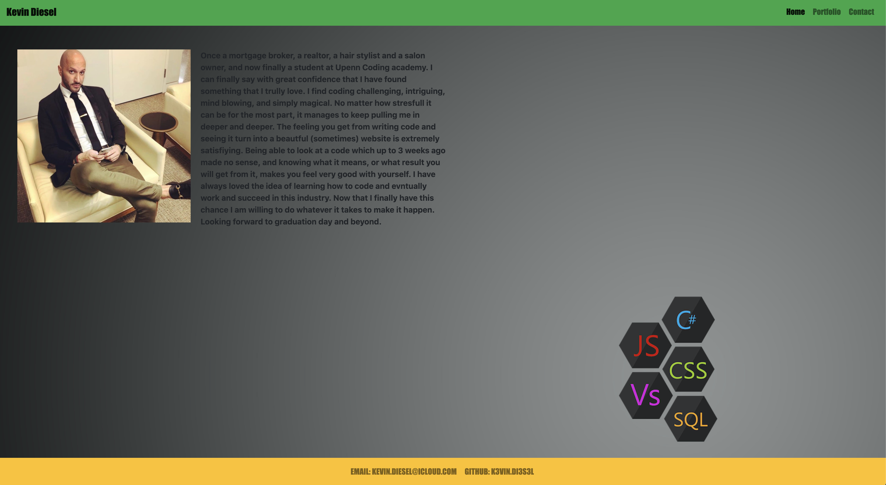
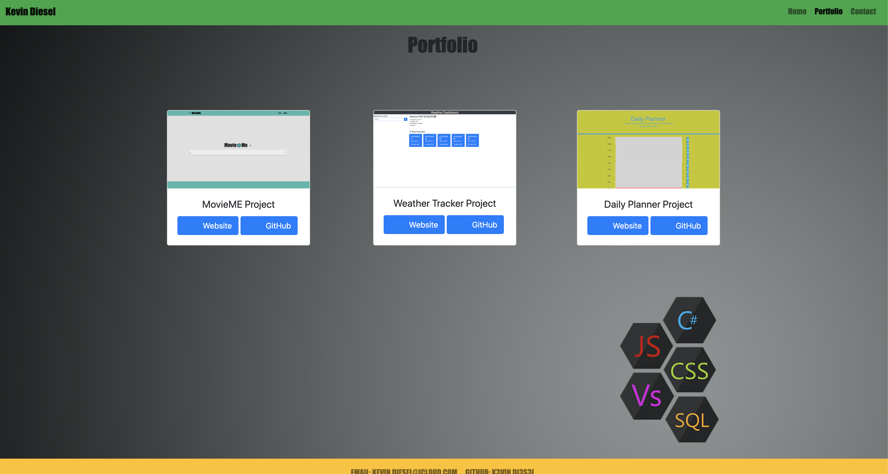
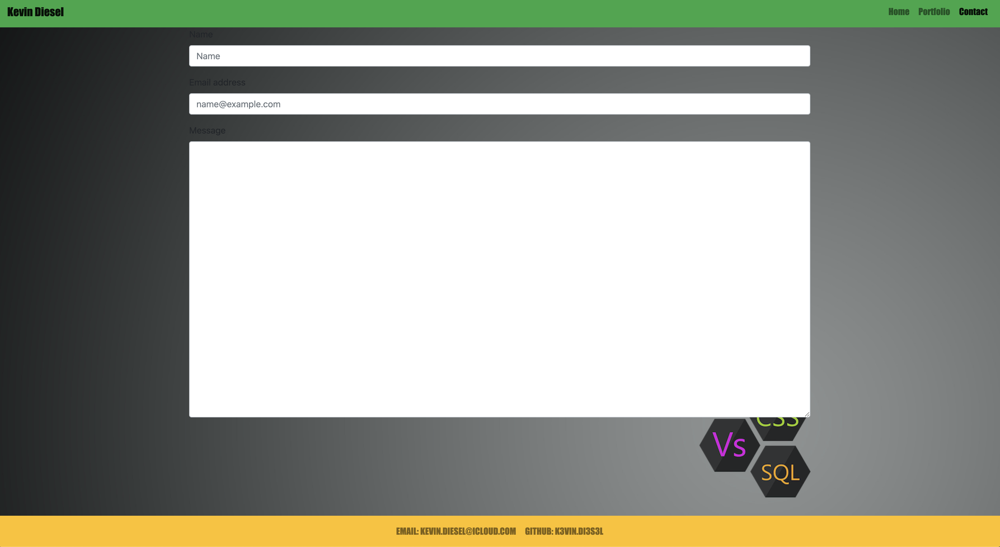
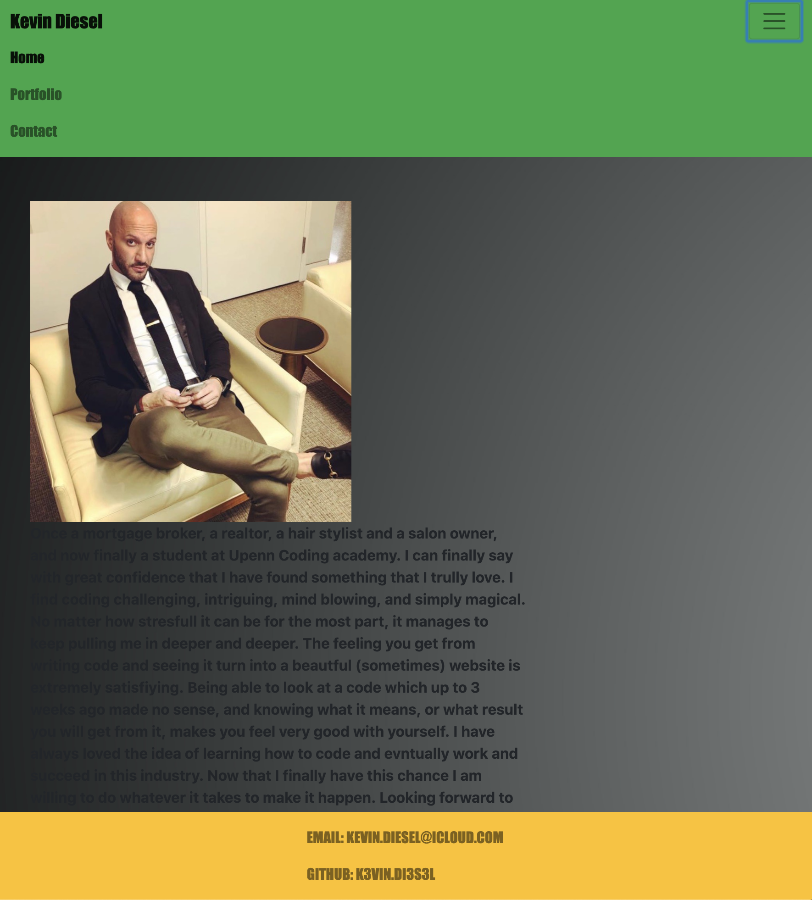

# Title 

Bio/Portfolio

## Project Descritpion

This is my bio/portfolio still in early stages. I made few changes to the older version by adding a background image, changed the font family of the texts on all pages, added a project and two other assigments that I completed the past few months, and lastly I added links for their github repos as well as links for their deployed version
 
For a better visual understanding please take a look at the following screenshots.

### Screenshots

### How to access the quiz
URL: https://k3vindi3s3l.github.io/k3vindi3s3l.homework2.io/
 
URL: https://github.com/K3vinDi3s3l/k3vindi3s3l.homework2.io

### Built With

* HTLM (https://developer.mozilla.org/en-US/docs/Glossary/HTML#Concept_and_syntax)
* CSS (https://www.w3schools.com/css/)
* BootStrap (https://getbootstrap.com/docs/4.4/getting-started/introduction/)

